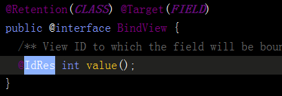
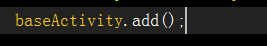
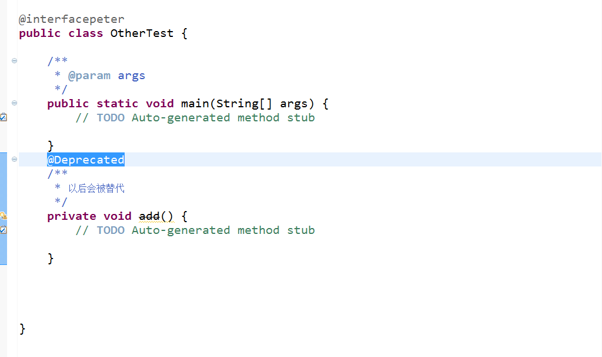
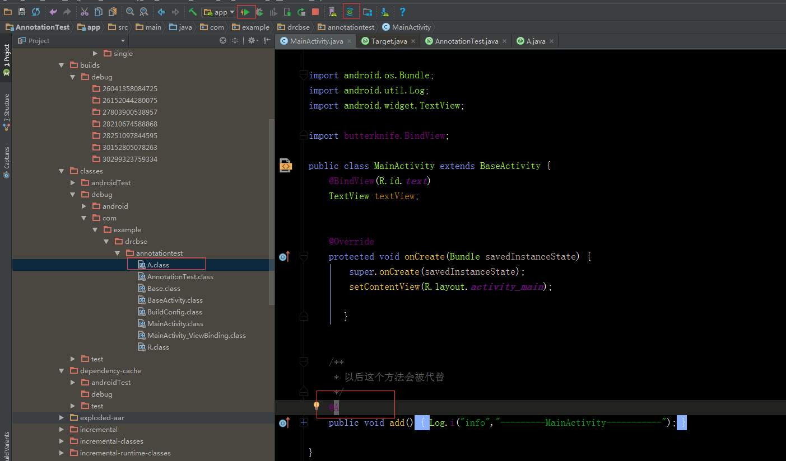

##1.注解之Java篇

Annotation，注解起源于JDK1.5，提供安全的类注释机制，用于将任何信息或者元素与程序机制（这里包括类，方法，变量等）进行关联，但是不能影响程序的进行

Annotation是一个接口类，三种标准的注解都是类接口  

三种标准注解：

1.Override（重载的父类的方法）

2.Deprecated（标记注解，在程序的编译过程中不会影响程序的编译，但会显示一些警告信息，标示这个在未来版本中可能被删除，建议配合javaDoc的符号，表明这个方法弃置后使用另一个方法）

3.SuppressWarining（抑制编译器产生警告的）

详细使用过程：

注意：使用这个注解的时候，尽量采用就近原则，范围越小越好。

错误示例：

四种标准元注解

@Target

@Retention

@Documented

@Inherited 

上述的四种元注解都有的作用：

@Target的作用就是描述使用的范围，使用在哪？不同的值表明不同的时候场景。

CONSTRUCTOR:主要描述于构造器

FIELD：尽可以声明类的变量

LOCAL_VARIABLE:描述局部变量

METHOD:描述方法

PACKGE:描述包

PARAMETER：描述参数

TYPE:描述类，接口， 枚举声明等

@Retention的作用是在什么级别保存该注解信息，保存在class文件当中可能会被虚拟机忽略，但不影响class使用等效果

SOURCE:在源文件中有效的

CLASS：在class文件中声明有效的

RUNTIME：在运行过程中声明需要保留

在注解的源代码里体现最深、

@Douumented用于描述其他类型的annotation应该被作为被标注的程序成员的公共API，可以被javaDoc文档化。

@interface表明是一个注解的接口

##注解之Android篇

Android中在Java的基础上又增加了几个Android独有的注解

使用就是先将注解的库依赖进来

	dependencies {
    compile 'com.android.support:support-annotations:22.2.0'
	}

一般情况下我们是不需要做这个操作的，因为com.android.support:appcompat的依赖库中已经包含了注解。

首先Goole为什么药在Java的基础上在定一些注解，出于什么理由？

真的必须要自己来写注解吗？

其实还有使用枚举的方式，但是为什么不用枚举呢？

其实用枚举也可以，但是枚举不是最佳的实践方式，因为Android中有很多常量，因为枚举会因为使用最简单的常量方式而导致内存占用大很多而被google列为不建议使用。因此才有了现在一些android的注解

最简单的常量方式：

常用的一些注解：

Null相关的注解：修饰的地方可以是方法参数，返回值等

>@Nullable 注解的元素可以是Null  
>@NonNull 注解的元素不能是Null  

区间范围注解：限定范围的注解，用于参数。
>@FloatRange  
>@IntRange

使用方法与效果

使用方式：@FloatRange(from=起始值, to=结束值)

限制长度大小的注解：限制输入的长度，用于参数，可限制String类型的长度或者数组

使用方法：@Size（）

还可以使用
>@Size(max = 1)  
>@Size(multiple = 3)

Color修饰符：Color用的最多，但是也是容易出错的

使用方式以及源码中的使用：@ColorInt

获取固定文件夹下的文件：称为资源修饰符
AnimRes  
AnimatorRes  
AnyRes  
ArrayRes  
AttrRes  
BoolRes  
ColorRes  
DimenRes  
DrawableRes  
FractionRes  
IdRes  
IntegerRes  
InterpolatorRes  
LayoutRes  
MenuRes  
PluralsRes  
RawRes  
StringRes  
StyleRes  
StyleableRes  
TransitionRes  
XmlRes  

示例源代码：

四种线程的注解方式：

@UiThread,通常可以等同于主线程,标注方法需要在UIThread执行,比如View类就使用这个注解

@MainThread 主线程,经常启动后创建的第一个线程

@WorkerThread 工作者线程,一般为一些后台的线程,比如AsyncTask里面的doInBackground就是这样的.

@BinderThread 注解方法必须要在BinderThread线程中执行,一般使用较少.

源码中的使用：  
以下源码取自于：AsyncTask

@CallSuper：重写的方法必须调用父类的方法

源码中的使用：

效果验证：

@RequiresPermission:Android独有注解,权限

使用方式：@RequiresPermission(权限)

例如：@RequiresPermission(Manifest.permission.SET_WALLPAPER)

效果：在使用这个注解之后，你调用这个方法的时候第一次会警告你在Manifest文件中没有加入这个权限，如果没有警告你了，你可以clean下就会出现，但是你没加这个权限后，程序在运行的时候也不会崩溃。

##ButterKnife之初窥

##注解之区分篇
@Deprecated  

虽然这注解时表示以后可能不用，但是在java和android里面的效果是不一样的

