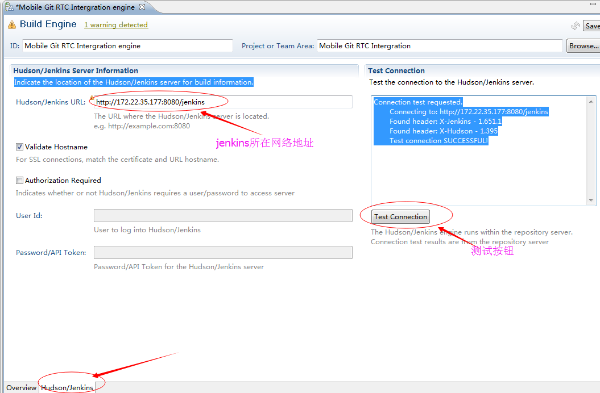

#基于Tomcat的Jenkins环境搭建#
##Tomcat的安装##
###1.Tomcat的安装###

	sudo yum search tomcat//搜索tomcat  
	sudo yum install tomcat//选择tomcat的版本  

###2.Tomcat的配置，这里的配置主要是为了解决公司中下载gradle过慢问题###
问题描述:下载gradle过慢  

解决方式：在基于tomcat下载gradle包，后台自动下载gradle，配置tomcat文件夹，将tomcat上传上去。  

解决步骤：  

1.首先要在Tomcat的ROOT文件夹下创建一个文件夹或者不创建直接导入进去，建议创建文件夹。  

2.修改配置文件：server的tomcat是使用yum方式安装的，修改配置文件需要在*/ect/tomcat/web.xml*下修改  

修改原因：缺省是flase，在web上不会显示这个文件夹  

修改文件如下  

><param-value>flase</param-value>//这里是flase，需要改为true。   

重新启动tomcat，请将下载好的Gradle文件放入到刚才建好的文件夹里访问网络地址如下：http://172.22.35.177:8080/gradle/  

###3.Tomcat的启动###

本文通过yum的方式安装的Tomcat，需要用系统命令进行启动。  

启动：  

>sudo systemctl start tomcat.service  

停止：  
>sudo systemctl stop tomcat.service  

重新启动：  
>sudo systemctl restart tomcat.service  

查看tomcat是否成功启动：  
>ps -aux|grep tomcat  
##Android SDK的安装##  
###下载SDK Tools压缩包：###

在浏览器中输入网址：[http://developer.android.com/intl/zh-cn/sdk/index.html](http://developer.android.com/intl/zh-cn/sdk/index.html)或[http://www.androiddevtools.cn/](http://www.androiddevtools.cn/)

1.使用xshell在window下载（建议使用xshell下载SDK Tools）

  

找到上图中的位置，选中直接下载到本地，然后通过rz命令上传到server，然后解压出来。  

上传命令：  

输入**“rz”**后回车，选中下载好的tools点击确认上传。  

2.在linux系统下使用wget命令下载  

  

按照上图中的位置，在此处右击选择复制链接地址。  

下载命令：  

>wget https://dl.google.com/android/android-sdk_r24.4.1-linux.tgz  

解压命令：

>tar xvzf android-sdk_r24.4.1-linux.tgz  

###配置SDK环境变量###
请先cd /ect下面找到**profile**文件,然后用vim命令打开文件（注意：在使用profile这个文件时，可能没有权限，所以在使用vim命令前需要sudo下，完整的命令是：**sudo vim profile**）。  
编辑文件：   

	ANDROID_HOME=/home/build/androidSDK/android-sdk-linux //这里输入的是SDK的路径  
	export PATH="$PATH:$ANDROID_HOME/tools:$ANDROID_HOME/platform-tools"  
	export ANDROID_HOME  

配置好上述的文件后请使用命令行重启文件：  

	source /ect/profile  

###下载SDK###

使用TightVNC client端连接server，通过SDK Manager的图形化界面安装SDK。  
打开Teminal，进入命令行模式：

  

直接输入**./android**命令，将出现SDK Manager的图形化界面，该界面和window上使用SDK Manager界面是一致的，必要时需要设置代理，然后下载SDK。  

  

###使用yum安装jdk###

通过**yum search**命令搜索JDK，选中自己所需要安装的JDK  

  

上述图片有两条命令：  

	sudo yum search openjdk  //搜索JDK  
	yum  install  java-1.80.-openjdk-devel.x86_64 //安装JDK  

安装完成后，请试验下是否能在本地build过，本地build实例：  

第一步：通过rz命令上传一个本地android程序。  

第二步：进入上传的demo的文件夹下，如下图：  

  

第三步：build命令，使用**./gradlew**命令，就可以查看结果：  

  

###Android Project的本地构建问题###
问题：缺少一个安装的libz的so包  

问题描述：在build的过程中会报错：  

>AAPT err(253082523): /home/build/androidSDK/android-sdk-linux/build-tools/23.0.3/aapt: error while loading shared libraries: libz.so.1: cannot open shared object file: No such file or directory

解决方法：使用yum方式安装zlib包  

##基于Tocmat环境下安装Jenkins##
###下载Jenkins###
到Jenkins的官方网站[https://jenkins.io/](https://jenkins.io/)下载Jenkins最新版本，可以先在window下载，然后通过rz命令，将Jenkins.war上传服务器端的（/var/lib/tomcat/webapps）, 然后重新启动tomcat，最后在浏览器上输入http://serverIP:8080/jenkins/，就可以进入Jenkins UI界面。  

###Jenkins插件的下载与安装###
首先点击系统管理，然后点击管理插件,进入管理插件界面：  

其次设置代理，管理插件->高级  

配置完成后可以在右下角->高级中,测试下。  

然后在可选插件中，选择gradle plugin和android lint plugin进行安装。  

###Jenkins邮件配置（如果不需要请跳过）###

在系统管理->系统设置->邮件通知进行如下设置：   

  

测试下后点击保存。  

###Build过程中遇到问题:###
问题截图如下：  

解决方法：在系统配置中全局属性中增加一个键值对。  

##Jenkins与RTC的关联（属于个人需要，如果个人不需要刻意跳过）##
###下载插件###

首先需要在插件管理中下载Team Concert Git Plugin插件

###RTC中的设置：###

第一步：在team视图中，团队工作件中展开构建文件夹，如下图所示：

第二步：在buildEngines中右键，new Build Engines，然后进入下面的界面，点击next，如图所示：  

第三步：build的工程中选择jenkins，（一定要选择jenkins）。  

第四步：点击Finish后，配置Jenkins的所在网址

第五步：配置Builds  

第六步：在builds出右击 New Build Definition，进入下列界面，在新选项卡中，点击next.  

第七步：在新建选项卡中选择Hodson/Jenkins Build的选项，ID可以修改也可以不修改，然后点击next。  

剩下的缺省就好了，直接next，next到最后。  

第八步：添加项目的构建  

第九步：点击ADD，进入界面的添加界面，选中需要添加的项目，点击OK。  

第十步：Hudson/Jenkins的设置  

##Jenkins项目配置##
###新建项目###
新建->选择构建一个自由风格的软件项目->输入项目名称然后点击OK.  

###Git相关配置###

构建的时候选择如下：  

在下面输入的地址和用户名密码之后可以点击测试测试下是否通过  

构建定义的查找（下面部分内容和RTC结合，所以不需要的可以略过）

双击图中选中的地方，然后进入下一个界面  

验证： 

 

如果Jenkins不知道的话可以去下面查找：  

 
 

然后在新增一个构建步骤： 
 
 
 

构建时可以设置下内容，比如构建时间等内容。  

 

构建后的步骤：  

 

选择发送邮件：  

###设置RTC Log###

点击Save保存就可以了.